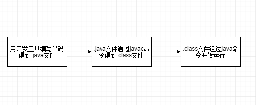
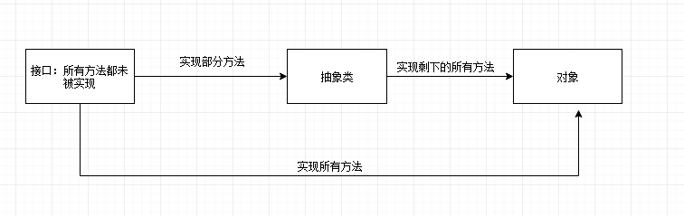
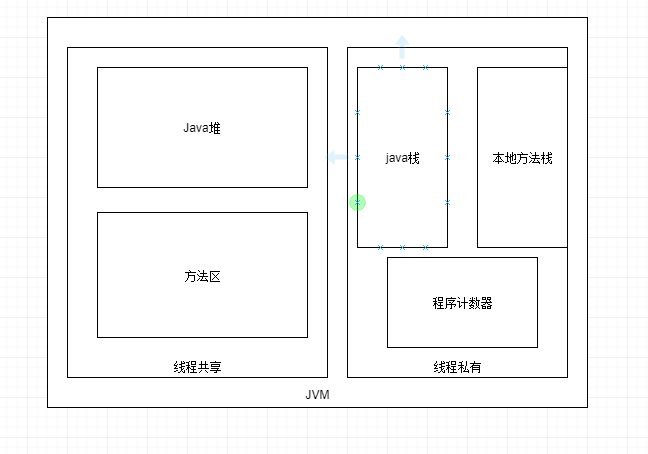

# 0. 描述一个Java程序从编写到运行的完整过程(图文表达)



# 1. 阐述你对 Java 中 接口、抽象类、对象 的理解(图文表达 会用 UML 的尽量用 UML)

接口中所有的方法都未被实现。

抽象类即实现了接口中的部分方法，但还有部分方法未被实现。

对象即实现了接口中的所有方法。



# 2. 举出几个常用的 git 命令，描述什么情况下会产生代码冲突？如何解决？

git init 

git clone

git remote add 

git add

git status

git rm

git commit -m"descripse"

git push

git pull

git  fetch 

git log
冲突是当远程仓库的文件改变了之后，要push的版本和原创仓库的不一样，
要fix 之后才能重新push

# 3. 简单描述一下 jvm 内存模型(图文表达)

JVM由五个部分组成，分为线程共享和线程私有两种。线程共享的有Java堆和方法区；线程私有的有Java栈，本地方法栈和程序计数器。

Java堆：存放所有的对象实例，占内存最大。

方法区：存储被虚拟机加载的类信息，常量，静态常量，静态方法，运行常量池等。

Java栈：执行方法时用来存放返回值，局部变量表和各类对象引用等信息的区域。

本地方法栈：为虚拟机执使用到的Native方法服务。

程序计数器：记录当前线程执行的情况。



# 4. 编写一个单例类，要求程序能完成一定的功能(具体自定)

```java
public class Singleton{
    private static Singleton obj = new Singleton;
    private int num;
    private Singleton(){
        this.num=10;
    }
    public static Singleton get(){
        return obj;
    }

    public static void main(){
        Singleton obj = Singleton.get();
        system.out.println(obj.num);         
    }
```


# 5. 编写一个程序解决多线程问题，爸爸妈妈同时打儿子，儿子会扣血，但要求不能扣到0以下且扣血过程要准确;在此基础上尽量提高效率(具体类的设计和输出自定)

```java
package test;

public class Son {
	private volatile int blood;
	
	public Son(int blood) {
		this.blood = blood;
	}
	
	public int getBlood(){
		return this.blood;
	}
	public void setBlood(int blood) 
	{
		this.blood = blood;
	}
}

```

```java
package test;

public class Parent extends Thread
{
	String name;
	int harm;
	Son son = new Son(100);
	
	public Parent(String name, int harm, Son son)
	{
		this.name = name;
		this.harm = harm;
		this.son = son;
	}
	public synchronized void run(){
		
		while(son.getBlood()>0)
		{
			son.setBlood(son.getBlood()-this.harm);
			System.out.println(Thread.currentThread().getName()+" hits son.The rest of son's blood is" + son.getBlood());
			
			try {
					Thread.sleep(1);
				}
			catch(InterruptedException e) 
			{
					e.printStackTrace();
			}
		}
		System.out.println("son have been killed");
	}
}
```

```java
package test;

public class Hit {

	public static void main(String[] args)
	{
		Son son = new Son(100);
		Parent father = new Parent("father",1,son);
		Parent mother = new Parent("mother",1,son);
		father.start();
		mother.start();
	}
}
```

