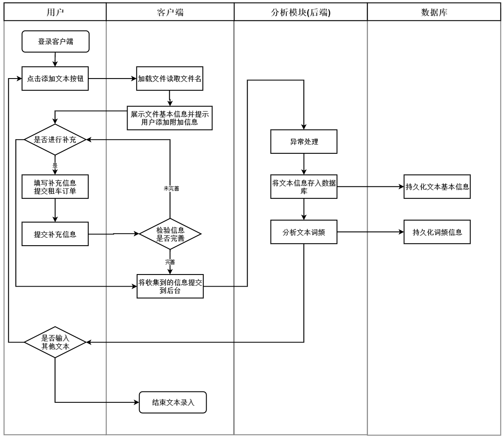

# 对项目一进行数据库设计分析

## 0. 基本流程（有多种方式，不强行统一）

1. 需求分析：针对每一个业务逻辑给出所涉及的对象（人和系统）
2. 泳道图分析：对需求分析的进一步逻辑细化，将整个详细的执行流程和执行逻辑绘制出来，一个业务需求对应一个泳道图分析
3. E-R图：根据泳道图分析构建E-R图，细化各个对象的属性及关系
4. 构建表：详细描述各个属性的特征

## 1. 需求分析

- 文本录入及词频分析：用户、客户端、分析模块、数据库
- 词频搜索
- 文件(文本)信息输入和修正
- 文章段落分析

## 2. 泳道图构建

### 文本录入及分析：

### 词频展示及搜索

### 文件(文本)信息输入和修正

### 文章段落分析

## 3. E-R图

## 4. 数据库表

### t_b_word ：词汇表

| 字段          | 类型      | 键   | 为空 | 默认              | 备注                   |
| ------------- | --------- | ---- | ---- | ----------------- | ---------------------- |
| spell         | varchar   | UNI  | no   | NULL              | 单词拼写               |
| paragraph_num | int       |      | no   | NULL              | 单词所在段落编号       |
| row_num       | int       |      | no   | NULL              | 单词所在行(对全文而言) |
| frequency     | int       |      | no   | NULL              | 词频(对全文而言)       |
| id            | bigint    |      | no   | NULL              | 自增id,唯一主键        |
| create_time   | datatime  |      | no   | NULL              | 创建时间               |
| modify_time   | datatime  |      | no   | NULL              | 服务端更新时间         |
| ts            | timestamp |      | no   | CURRENT_TIMESTAMP | 数据库端更新时间       |

### t_b_book：文本(书籍表)

| 字段        | 类型      | 键   | 为空 | 默认              | 备注             |
| ----------- | --------- | ---- | ---- | ----------------- | ---------------- |
| name        | varchar   |      | no   | NULL              | 文件名(书名)     |
| author      | varchar   |      | no   | NULL              | 作者             |
| publisher   | varchar   |      | no   | NULL              | 出版社           |
| pub_date    | datatime  |      | no   | NULL              | 出版日期         |
| type        | varchar   |      | no   | NULL              | 图书类别         |
| cover_url   | varchar   |      | no   | NULL              | 封面图片存储地址 |
| text_url    | varchar   |      | no   | NULL              | 文本存储地址     |
| id          | bigint    | PRI  | no   | NULL              | 自增id,唯一主键  |
| create_time | datatime  |      | no   | NULL              | 创建时间         |
| modify_time | datatime  |      | no   | NULL              | 服务端更新时间   |
| ts          | timestamp |      | no   | CURRENT_TIMESTAMP | 数据库端更新时间 |

