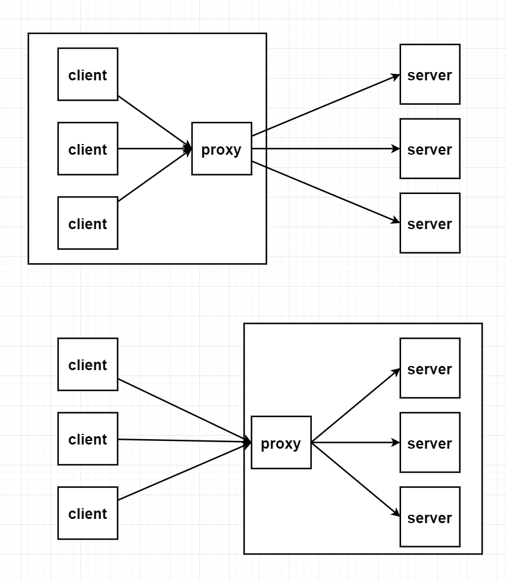
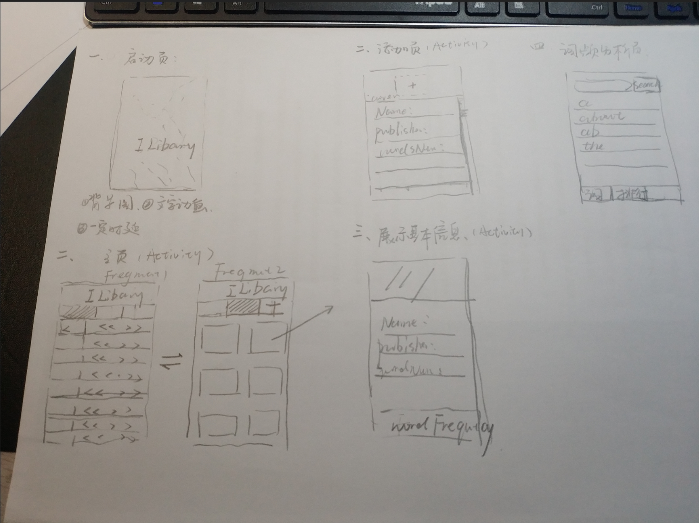

# 第一学期

## 基本工具的使用

#### 分布式版本控制 git

#### Linux基本命令

#### MarkDown 文档的编写


## 计算机基础(java语言角度)

#### jvm运行时内存模型

#### 进程及线程

```
并发与并行
```

#### 网络通信

```
反向代理：nginx (server对client透明)
正向代理：翻墙原理 (client对server透明)
nginx
```



#### 数据库设计


## 设计模式

#### Java实现单例模式

```
三个基本条件
```

#### Java实现策略模式

```
利用接口
```

# 假期安排

## Web后台

```
1. java基础(进阶/高阶)
2. spring/spring boot
3. Nginx
4. Linux
5. http/https协议
```

## Web前端

```
1. html/css
2. vue
3. javascript
```

##  Android

```
1. Java基础(进阶/高阶)
2. 第一行代码例子都敲一遍，把前的项目完整的构建出来或进一步完善
3. 原型设计工具(了解)
4. Linux
5. http/https协议
```

## 参考项目

Web

Android




