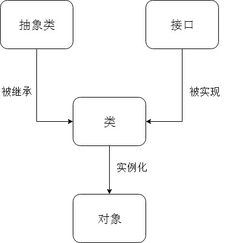

# 接口、抽象类、对象

  1.接口：存放一系列未被实现的方法。不能实例化对象，必须被类实现
         (只能做方法声明，不能做方法实现）
        （接口里定义的变量：公共静态常量）
        （只能有抽象方法、不可变常量）

  2.抽象类：含有未被实现的方法的类。不能实例化对象，必须被子类继承
          (可以做方法声明，也可以做方法实现）
         （抽象类里定义的变量：普通变量）
         （可以有具体的方法、属性）
         
  3.对象：类的实例化

