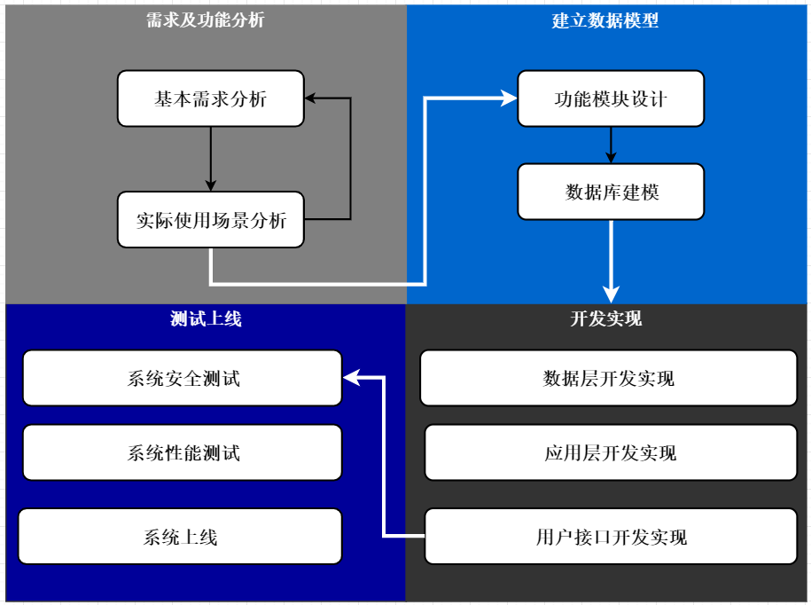

# 近一到二个月的任务(具体看大家的进度)

## 任务核心

根据下面的<需求>部分完成整个系统的设计和实现

## 需求(web)

1. 从本地上传文本文件到服务器
2. 分析文本文件中的词汇，包括词汇量、每个单词出现的频次、统计出出现频率前10的词汇
3. 提供web端GUI、展示一篇文章词频前1000的词汇(一个词汇独占一行)、提供搜索接口
4. 对词汇的分析数据需要存入数据库具体需要设计多少张表自由决定，数据库统一用MySQL
5. 框架统一使用Spring Boot、ORM框架统一使用MyBatis
6. 测试文件见：Sources目录

## 需求(Android)

1. 学习了解内嵌式数据库SQLite、了解安卓四大组件、学习了解ListView RecyclerView Fragment
2. 分析文本文件中的词汇，包括词汇量、每个单词出现的频次、统计出出现频率前10的词汇
3. 对词汇的分析数据需要存入数据库具体需要设计多少张表自由决定，数据库统一用SQLite
4. 用ListView RecyclerView展示一篇文章词频前1000的词汇(一个词汇独占一行)
5. 提供搜索接口和前端按钮
6. 要求功能布局合理采用多个Activity 或 Fragment 对不同的功能进行布局展示
7. 测试文件见：Sources目录

## 附加说明

1. Android的参考资料《第一行代码》基本可以解决大部分问题，有其他疑问可先尝试搜索解决

2. 项目需要用git进行版本控制

3. 开发过程中不要把Java基础落下，不懂的要回去补

4. 进入项目阶段后尽量多花点时间，多交流尽量避免单打独斗，跟不上的同学有可能会被淘汰

5. 开发过程中尽量把开发文档跟上不要只有代码没有文档

6. 上面的需求只是基本需求，后面我可能会进行更改或补充

7. 整体开发进程：完成前三个阶段即可第四个阶段具体看个人进度

   