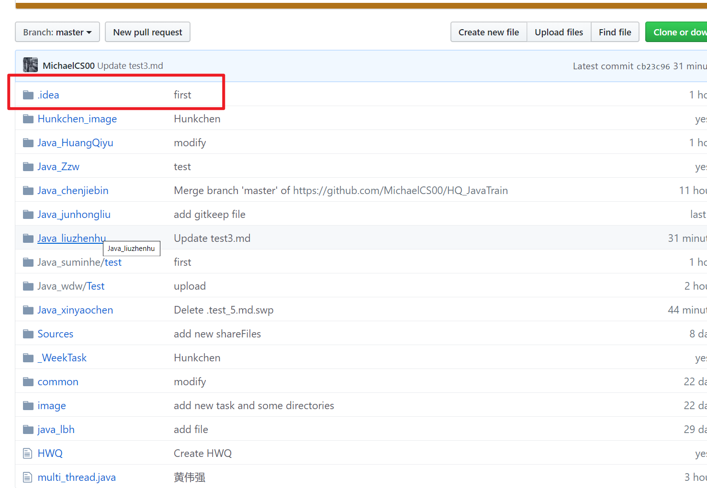
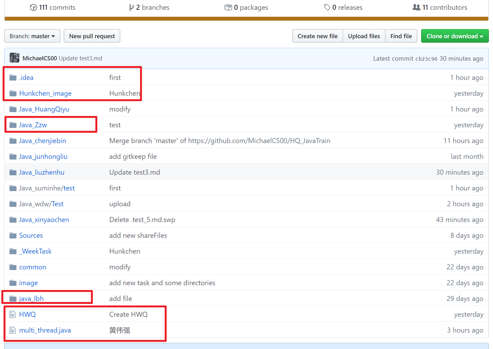
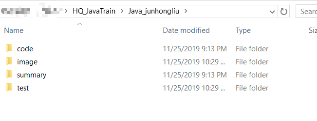
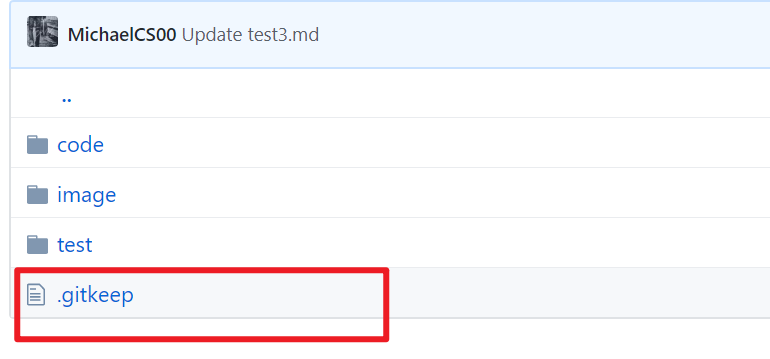

## 1. 注意不要把工程文件推到仓库之前有给大家讲 .gitignore 文件 再去了解回顾一下

## 2. 注意目录结构，不要把个人的文件放到了仓库的根目录

## 3. 每个人的目录组织结构大概如下，不要把个人的 image 文件夹放到仓库根目录

**

## 4. .gitkeep 文件用完了，即此目录已经不再是空目录的时候及时删除该目录下的 .gitkeep 文件

**

## 5. 具体大家做测试的时候遇到的问题及时记录下来，包括原因、解决思路、办法 整理成自己的总结。

## 6. 遇到不能自己思考解决的问题，首先明确问题出现的情景把问题描述清楚向其他提问或在群里提问